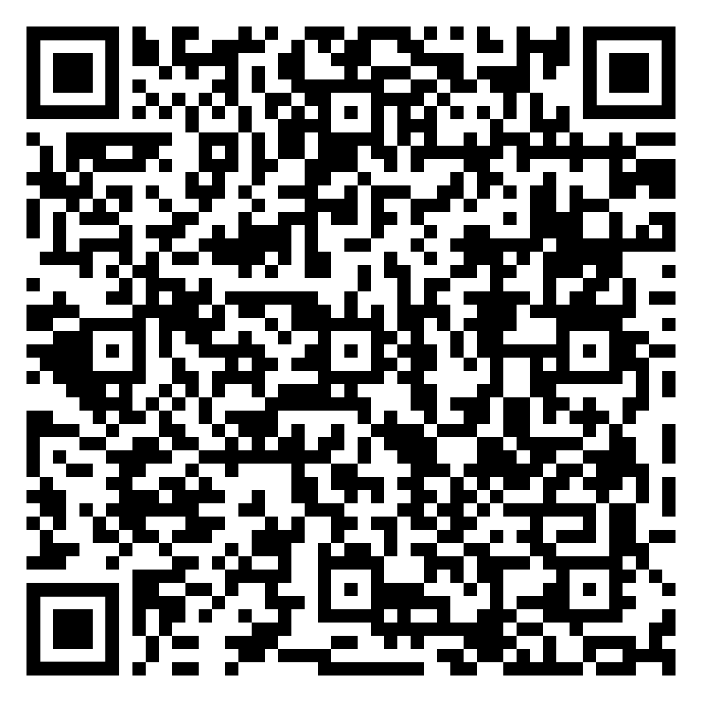

# dotfiles-termux

> **Termux configuration for mobile home devices.**


[](LICENSE)

---

<div align="center">
  
  <p><i>Scan the QR code to clone the repository or use the one-liner below.</i></p>
</div>

---

## 🚀 Instant Deployment

Transform your Termux environment with a single command. This bootstrap script handles package updates, core utilities, and local configurations automatically.

```sh
pkg install curl -y && bash -c "$(curl -fsSL https://raw.githubusercontent.com/unamatasanatarai/dotfiles-termux/refs/heads/master/first-run.sh)"
```

> [!IMPORTANT]
> **Android Permissions**: You will be prompted to grant Storage access and Wake Lock. These are essential for the background SSH server and persistent operations.

## ✨ Key Features

- **🛡️ Secure Access**: Pre-configured `sshd` with auto-start on boot via Termux-Boot.
- **🛠️ Power Tools**: Full suite including `tmux`, `vim`, `git`, `curl`, and `shfmt`.
- **🎨 Sensible Defaults**: Optimized configurations for a productive mobile terminal experience.
- **🔋 Battery Optimized**: Integrated Wake Lock management to prevent service interruption.
- **📂 Storage Ready**: Easy access to Android storage and SD cards.

## 🔄 Lifecycle Management

### Synchronizing Changes
Keep your environment up to date with the latest configurations and package versions:
```sh
make update
```

### Repository Structure
An organized layout ensures easy customization and maintenance:
- **`preflight/`** — Low-level system initialization (upgrades, permissions).
- **`apps/`**      — Application-specific setup scripts and configuration linking.
- **`bin/`**       — Custom helper scripts automatically symlinked to your `~/bin`.

## 🛠️ Customization

Extend the ecosystem by adding your own specialized tools:

1. **New Script**: Create `apps/myapp.sh` with your installation logic.
2. **Integration**: Add `source apps/myapp.sh` to `apps/all.sh`.
3. **Deploy**: Run `make` to apply the changes.

## ❓ Troubleshooting & FAQ

**Q: How do I access external SD card storage?**
A: Termux uses a symlink system. After running the setup, you can link your specific SD card ID:
```sh
cd ~/storage
ln -s /storage/0123-4567 sdcard   # Replace with your SD card ID
```
*Tip: Use a file manager (like Total Commander) to find your exact SD card mount ID.*

---

<div align="center">
  Built with 🧛🏽‍♂️ for the Termux Community.
</div>
